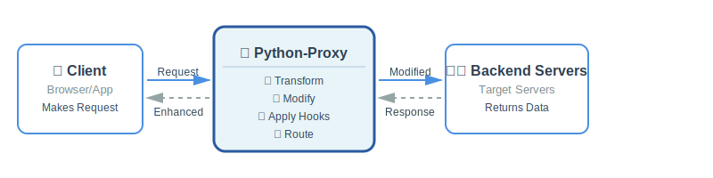
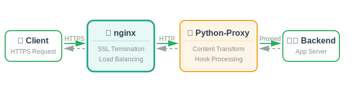

# 🚀 python-proxy

> **A powerful, transparent HTTP proxy server with intelligent traffic modification capabilities.**

<div align="center">



**~ nginx with superpowers** • **Zero-code configuration** • **Production-ready**

</div>

---

## ✨ Overview

**Python-proxy** is a high-performance, asynchronous HTTP proxy server built on `aiohttp` that sits between clients and backend servers, allowing you to **intercept**, **inspect**, and **modify** HTTP traffic in real-time. Unlike traditional proxies that simply forward traffic, python-proxy provides a sophisticated **hook system** that enables you to transform requests and responses on-the-fly.

### 🎯 What Makes It Special?

> 💡 **Think of it as ~ nginx with superpowers**
> Get the reliability and performance of a production-grade proxy, combined with the flexibility to programmatically modify any aspect of HTTP traffic.

**Common Use Cases:**
- 🔐 Add authentication headers
- 📊 Inject analytics scripts into web pages
- 🧪 Mock API responses for testing
- 🔗 Rewrite URLs and links
- 🛡️ Sanitize sensitive data
- 🎲 Implement custom routing logic

### 🎨 Developer Experience First

```yaml
# Zero-code configuration - just edit YAML!
post_hooks:
  - hostname: "example.com"
    url_pattern: "/*"
    hook: "link_rewrite"
    params:
      from_domain: "example.com"
      to_domain: "example.com.local"
```

🟢 **Start Simple**: Use built-in YAML hooks for redirects, text replacement, and HTML modifications
🟡 **Scale Up**: Write custom Python hooks with full access to request/response data
🔵 **Go Advanced**: Implement rate limiting, caching, A/B testing, or external API integration

⚡ **Async architecture** ensures modifications don't compromise performance, handling **thousands of concurrent connections** efficiently.

### 🌍 Perfect For Every Environment

| Environment | Use Case | Benefits |
|------------|----------|----------|
| 🔧 **Development** | Test API responses | No backend changes needed |
| 🧪 **QA/Testing** | Inject test data | Simulate edge cases easily |
| 🚀 **Production** | Content transformation | Add security headers on-the-fly |
| 🔬 **Security** | Traffic analysis | Intercept and modify requests |

**Seamless nginx integration** for production deployments - handle SSL termination and load balancing while python-proxy focuses on intelligent content modification.

### 🛠️ Extensible Architecture

**Built-in hooks** handle common operations:
- ↩️ 301/302 redirects
- 📝 JSON field manipulation
- 🏗️ HTML element modifications (XPath)
- 🔗 Link rewriting
- 🌐 Content fetching from external sources

**Python hook system** provides:
- 🔍 Automatic discovery
- 🎯 Decorator support
- ⚠️ Comprehensive error handling
- 🎛️ Full programmatic access

Whether you're a **developer** needing quick traffic manipulation or a **DevOps engineer** building sophisticated proxy infrastructure, python-proxy scales from simple scripts to enterprise deployments.

---

## 🎁 Features

- ⚡ **Async/Await Architecture**: Built on `aiohttp` for high-performance async I/O
- 📤 **Request Modification**: Modify requests before they're proxied (headers, body, URL, etc.)
- 📥 **Response Modification**: Modify responses after receiving from target (HTML injection, content replacement, etc.)
- 🎣 **Hook System**: Simple Python-based hook system with automatic discovery
- ⚙️ **Configuration-Based Hooks**: Powerful built-in hooks (redirects, rewrites, HTML/text transformation) via YAML config - no coding required!
- 🔧 **Flexible Configuration**: Configure via CLI arguments, environment variables, or YAML config file
- 🎯 **Header-Based Routing**: Route requests to different targets using `X-Proxy-Server` header

## 📦 Installation

```bash
# Install from source
pip install -e .

# Or install dependencies directly
pip install -r requirements.txt
```

> 💡 **Requirements**: Python 3.8 or higher

---

## 🚀 Quick Start

### 💻 Basic Usage

```bash
# Start proxy on default port 8080
python-proxy

# Start with custom port
python-proxy --port 3128

# Proxy all requests to a specific target
python-proxy --target http://example.com

# Use a configuration file
python-proxy --config config.yaml
```

### ⚡ Quick Start with realmo.com.local (Default Configuration)

> 🎯 The default `config.yaml` is **pre-configured** for proxying realmo.com locally with automatic link rewriting!

```bash
# 1️⃣ Add to /etc/hosts
echo "127.0.0.1 realmo.com.local" | sudo tee -a /etc/hosts

# 2️⃣ Set up port 80 capability (one-time)
./scripts/setup_port80.sh

# 3️⃣ Start proxy with default config
python-proxy --config config.yaml

# 4️⃣ Browse to http://realmo.com.local
```

**✨ What this does:**
- 🔄 Proxies `realmo.com.local` → `realmo.com:80`
- 🔗 Automatically rewrites all `realmo.com` links to `realmo.com.local`
- 🎯 Keeps all traffic flowing through the proxy for testing/development

📚 See [examples/REALMO_SETUP.md](examples/REALMO_SETUP.md) for detailed guide and customization options.

### 🔓 Running on Port 80 (Privileged Port)

**✅ Quick Install (Recommended):**
```bash
# Install wrapper and set up port 80 capability
./scripts/setup_port80.sh

# Now use from anywhere
python-proxy --host 192.168.2.7 --port 80
```

**🔧 Manual Setup:**
```bash
# One-time setup (resolves symlinks if needed)
sudo setcap 'cap_net_bind_service=+ep' $(readlink -f $(which python3))

# Now run without sudo
python-proxy --host 192.168.2.7 --port 80
```

📚 See [examples/port80_setup.md](examples/port80_setup.md) for detailed instructions and alternatives.

### 🌐 Using Environment Variables

```bash
export PROXY_PORT=8080
export PROXY_TARGET=http://example.com
export PROXY_HOOKS_DIR=./hooks
python-proxy
```

### 📡 Making Requests Through the Proxy

The proxy supports multiple ways to specify the backend target:

1. **X-Proxy-Server** - Simple host or host:port format
2. **Default target** - Configured via CLI or config file
3. **Automatic .local domains** - Requests to `hostname.local` automatically route to `hostname`

```bash
# Using X-Proxy-Server (simple format)
curl -x http://localhost:8080 \
     -H "X-Proxy-Server: example.com" \
     http://example.com/page

# Using X-Proxy-Server with custom port
curl -x http://localhost:8080 \
     -H "X-Proxy-Server: example.com:8080" \
     http://example.com/page

# Override the Host header sent to backend
curl -x http://localhost:8080 \
     -H "X-Proxy-Server: 192.168.1.100:8080" \
     -H "X-Proxy-Host: myapp.example.com" \
     http://example.com/page

# With default target configured
curl -x http://localhost:8080 http://example.com/page
```

#### Header Reference

- **X-Proxy-Server**: Backend server as `host` or `host:port`
  - Default port: 80 (http) if not specified
  - Port 443 automatically uses HTTPS
  - Examples: `example.com`, `example.com:8080`, `192.168.1.100:3000`

- **X-Proxy-Host**: Override the Host header sent to backend server
  - Useful for virtual hosting or when backend expects specific hostname
  - Example: `myapp.example.com`

### Automatic .local Domain Routing

The proxy automatically strips the `.local` suffix from hostnames and routes to the actual domain on **port 80** (standard HTTP). Any port specified in the `.local` request is ignored. This is useful for local development and testing.

```bash
# Request to example.com.local routes to example.com:80
curl -x http://localhost:8080 http://example.com.local/page

# Port in .local URL is ignored - still routes to port 80
curl -x http://localhost:8080 http://api.example.com.local:8080/data
# → Routes to api.example.com:80

# Configure in /etc/hosts for easy testing:
# 127.0.0.1 myapp.com.local
curl -x http://localhost:8080 http://myapp.com.local/
```

**Behavior:**
- `hostname.local` → `hostname:80`
- `hostname.local:XXXX` → `hostname:80` (port ignored)
- Always uses HTTP (port 80), not HTTPS

**Use cases:**
- Local development: Test production URLs locally
- /etc/hosts testing: Add `.local` entries to route through proxy
- Network testing: Intercept specific domains without DNS changes

**Example /etc/hosts setup:**
```
# Add .local entries that proxy will strip and forward to port 80
127.0.0.1 api.example.com.local
127.0.0.1 cdn.example.com.local
```

Then requests to `api.example.com.local:8080` go through your proxy to `api.example.com:80`.

## 🎣 Configuration-Based Hooks

> ⚡ **NEW!** Configure powerful hooks directly in your YAML config - **no Python coding required!**

Perfect for redirects, URL rewrites, content modification, and more.

### 💡 Quick Example

```yaml
# config.yaml
host: "0.0.0.0"
port: 8080

hook_mappings:
  # Pre-hooks (execute before backend, can skip backend call)
  pre_hooks:
    - hostname: "example.com"
      url_pattern: "/old-page"
      hook: "redirect_301"
      params:
        location: "https://example.com/new-page"

  # Post-hooks (execute after backend, modify response)
  post_hooks:
    - hostname: "example.com"
      url_pattern: "/*"
      hook: "text_rewrite"
      params:
        pattern: "OldCompany"
        replacement: "NewCompany"
```

**🔌 Built-in hooks include:**

| Type | Hooks | Purpose |
|------|-------|---------|
| **⬅️ Pre-hooks** | `redirect_301`, `redirect_302`, `gone_410`, `not_found_404`, `static_html` | Execute before backend |
| **➡️ Post-hooks** | `url_rewrite`, `text_rewrite`, `link_rewrite`, `html_rewrite`, `xpath_replace_from_url`, `json_modify` | Modify responses |

**✨ Features:**
- 🌐 Hostname patterns with wildcards (`*.example.com`)
- 🔍 URL patterns with glob (`/api/*`) or regex (`regex:^/api/v[0-9]+/`)
- ⏭️ Pre-hooks can skip backend calls (redirects, errors)
- 🔧 Post-hooks modify content (HTML, text, JSON)
- 📁 **Organize hooks with includes**: Separate hooks by hostname into dedicated files

📚 **Learn more:**
- [examples/HOOKS.md](examples/HOOKS.md) - Complete documentation
- [examples/config_with_hooks.yaml](examples/config_with_hooks.yaml) - Inline hooks examples
- [examples/config_with_includes.yaml](examples/config_with_includes.yaml) - Include examples

---

### 🔗 Nginx Integration

Use python-proxy with **nginx** as a frontend reverse proxy for production deployments.

<div align="center">



</div>

**Nginx handles:** SSL termination, load balancing
**Python-proxy handles:** Hook-based content modification

📚 See [examples/NginxIntegration.md](examples/NginxIntegration.md) for complete configuration:
- 🌐 Proxy entire site or specific paths
- 🎯 Dynamic backend routing based on URL patterns
- ⚖️ Load balancing with multiple python-proxy instances
- 🔒 Production-ready setup with SSL/TLS
- ⚡ Performance optimization and security best practices

## 🐍 Creating Custom Python Hooks

> 🎓 **New to hooks?** Start with [Creating Custom Hooks - For Beginners](examples/CUSTOM_HOOKS_FOR_DUMMIES.md)
> A complete step-by-step tutorial with real-world examples!

For advanced use cases, you can write custom Python hooks. Place them in a hooks directory.

### 💡 Simple Hook Example

Create a file `hooks/my_hooks.py`:

```python
async def before_request(request, request_data):
    """Modify request before proxying."""
    # Add custom header
    request_data["headers"]["X-Custom"] = "MyValue"
    return request_data

async def after_response(response, body):
    """Modify response after receiving."""
    # Modify HTML content
    if b"<html>" in body:
        body = body.replace(b"</body>", b"<!-- Modified --></body>")
    return body
```

Then run with:
```bash
python-proxy --hooks ./hooks --target http://example.com
```

### 🚀 Advanced Hooks with Decorators

```python
from python_proxy.hooks import before_request, after_response

@before_request
async def add_auth(request, request_data):
    """Add authentication to API requests."""
    if "api.example.com" in request_data["url"]:
        request_data["headers"]["Authorization"] = "Bearer TOKEN"
    return request_data

@after_response
async def inject_script(response, body):
    """Inject JavaScript into HTML pages."""
    content_type = response.headers.get("Content-Type", "")
    if "text/html" in content_type:
        html = body.decode("utf-8", errors="ignore")
        script = '<script>console.log("Proxied!")</script>'
        html = html.replace("</head>", f"{script}</head>")
        return html.encode("utf-8")
    return body
```

**📚 Learn more:**
- 📖 [Creating Custom Hooks - For Beginners](examples/CUSTOM_HOOKS_FOR_DUMMIES.md) - Complete tutorial
- 📄 [HOOKS.md](examples/HOOKS.md) - Configuration-based hooks reference
- 📁 `examples/` directory - More hook examples

---

## ⚙️ Configuration

### 📝 Configuration File (YAML)

Create `config.yaml`:

```yaml
host: "0.0.0.0"
port: 8080
target_host: "http://example.com"
timeout: 30
hooks_dir: "./hooks"
log_level: "INFO"
```

### 🔢 Configuration Priority

1. 🥇 CLI arguments (highest priority)
2. 🥈 Configuration file (`--config`)
3. 🥉 Environment variables
4. 4️⃣ Default values (lowest priority)

## 🔓 Running on Port 80

> ⚠️ Ports below 1024 require special permissions. The proxy provides helpful error messages and multiple solutions.

```bash
# ✅ Quick setup (recommended)
./scripts/setup_port80.sh

# 🔧 Or manually
sudo setcap 'cap_net_bind_service=+ep' $(which python3)
python-proxy --host 192.168.2.7 --port 80
```

**🔀 Other options:**
- 🔴 Run with sudo (not recommended for production)
- 🔀 Use iptables port forwarding
- ⚙️ Use systemd socket activation

📚 See [examples/port80_setup.md](examples/port80_setup.md) for complete guide.

---

## 🛠️ Development

### 📥 Install Development Dependencies

```bash
pip install -r requirements-dev.txt
```

### 🧪 Run Tests

```bash
# Run all tests
pytest

# Run with coverage
pytest --cov=python_proxy

# Run specific test file
pytest tests/test_config.py
```

### 🔍 Linting

```bash
# Run ruff linter
ruff check .

# Auto-fix issues
ruff check --fix .
```

---

## 🎯 Use Cases

| Use Case | Description | Benefits |
|----------|-------------|----------|
| 🕷️ **Web Scraping** | Modify headers, inject credentials | Bypass restrictions |
| 🔧 **Development** | Test different API responses | No backend changes |
| 🔐 **Security Testing** | Analyze and modify traffic | Find vulnerabilities |
| 💉 **Content Injection** | Add scripts, styles, or content | Testing & analytics |
| 🧪 **API Testing** | Modify requests/responses | Simulate edge cases |
| 📊 **Traffic Analysis** | Log and analyze HTTP traffic | Debug & monitor |

---

## 📜 License

**Copyright (C) 2025 Sergey Porfiriev** <parf@difive.com>

This program is free software; you can redistribute it and/or modify
it under the terms of the **GNU General Public License** as published by
the Free Software Foundation; either version 2 of the License, or
(at your option) any later version.

This program is distributed in the hope that it will be useful,
but **WITHOUT ANY WARRANTY**; without even the implied warranty of
MERCHANTABILITY or FITNESS FOR A PARTICULAR PURPOSE. See the
GNU General Public License for more details.

📄 **License:** GPL v2 - See [LICENSE](LICENSE) file for details.

---

<div align="center">

**Made with ❤️ by Sergey Porfiriev**

⭐ Star this repo if you find it useful! • 🐛 Report issues • 💡 Contribute

</div>
